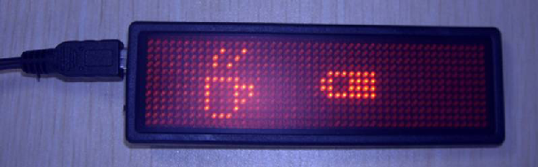

"LED Mini Board" Tool
=====================

This is a Python script to change the messages of "LED Mini Board 5.03" (B1236, B1248).
The frame format was reverse-engineered by spying the USB protocol of the
official software with Wireshark. Some settings are not available, but 
most should be easy to add (scroll speed, animations, special characters...).



Installation
------------
You need to have Python installed. Then download this tool's [latest version here](https://github.com/Caerbannog/led-mini-board/raw/master/led-mini-board.py).
- On Linux you will need special permissions to access the USB device.
  The USB-to-serial chip is PL2303 and appears as /dev/ttyUSB0 (the last digit may vary).
  Ensure that you have the right permissions or run the command with `sudo`.
- On Windows you will probably need to adapt the code that opens the serial port.

Usage
-----
After installing, connect the USB cable and run the following command from
the same directory. A few seconds later the transfer should be complete.
```
./led-mini-board.py /dev/ttyUSB* "This is message one" "...and this is message 2"
```
